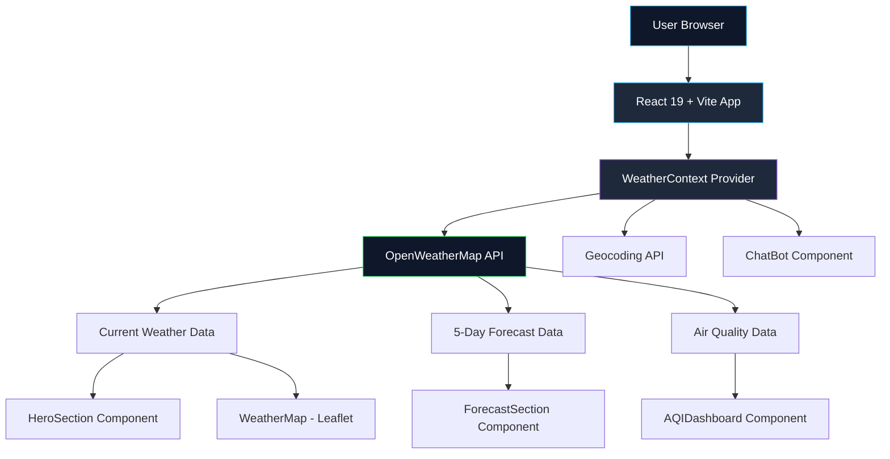
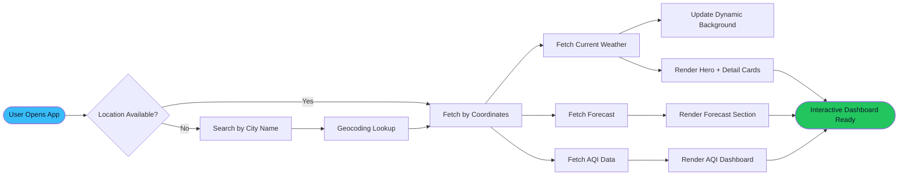

<div align="center">

# ☁️ BadalMitra

### Your Intelligent Weather Companion


**BadalMitra** *(Hindi: बादल + मित्र = "Cloud Friend")* is a sleek, modern weather intelligence dashboard that delivers real-time conditions, multi-day forecasts, and air quality insights — wrapped in a beautifully animated, glassmorphic interface.

<br/>

[](https://badal-mitra-livid.vercel.app)
[](https://github.com/shubhamnarware67-cmd/BadalMitra)

<br/>

[](https://github.com/shubhamnarware67-cmd/BadalMitra/stargazers)
[](https://github.com/shubhamnarware67-cmd/BadalMitra/network/members)
[](./LICENSE)
[](https://github.com/shubhamnarware67-cmd/BadalMitra/commits/main)


</div>

<br/>

<div align="center">

### 🌈 Preview

</div>

<p align="center">
  
</p>

<br/>

---

## 📖 About

**BadalMitra** is a modern, production-grade weather web app built to turn raw meteorological data into a calm, intuitive experience. Instead of cluttered dashboards and outdated UI patterns, BadalMitra focuses on **clarity, speed, and delight** — showing you exactly what you need to know about the sky above you, instantly.

Powered by **React 19**, **TypeScript**, **TailwindCSS v4**, and the **OpenWeatherMap API**, the app dynamically shifts its entire visual mood — gradients, tone, and atmosphere — based on real-world weather conditions at your location.

<br/>

## 💡 Why BadalMitra?

| The Problem 😓 | The BadalMitra Solution ✅ |
|---|---|
| Weather apps look outdated and cluttered | A clean, glassmorphic, animation-driven UI |
| Hard to track air quality alongside weather | Built-in **AQI Dashboard** with pollutant breakdown |
| Static, boring interfaces regardless of weather | **Dynamic backgrounds** that shift with real conditions |
| No conversational way to ask about weather | Integrated **ChatBot** for natural weather queries |
| Poor mobile experience | Fully **responsive**, mobile-first design |

<br/>

## ✨ Features

<div align="center">

| 🌦️ Feature | 📋 Description |
|:---|:---|
| **Live Weather** | Real-time temperature, humidity, pressure & wind data |
| **Multi-Day Forecast** | Detailed forecast cards with min/max temps & precipitation chance |
| **Air Quality Index** | Live AQI dashboard with pollutant-level breakdown (PM2.5, PM10, CO, O₃ & more) |
| **Interactive Map** | Leaflet-powered weather map visualization |
| **AI ChatBot** | Conversational assistant for quick weather queries |
| **Dynamic Theming** | Background gradients react live to current weather conditions |
| **Responsive UI** | Pixel-perfect across desktop, tablet & mobile |
| **Blazing Fast** | Powered by Vite for near-instant load times |
| **Modern Components** | Built on Radix UI + shadcn/ui design primitives |

</div>

<br/>

## 🛠️ Tech Stack

<div align="center">


</div>

<br/>

<details>
<summary><b>📦 Key Libraries Used</b> (click to expand)</summary>
<br/>

| Library | Purpose |
|---|---|
| `@tanstack/react-query` | Async state & data fetching management |
| `react-leaflet` / `leaflet` | Interactive weather map rendering |
| `recharts` | AQI & forecast data visualization |
| `framer-motion` | Smooth UI animations & transitions |
| `zod` + `react-hook-form` | Form validation |
| `wouter` | Lightweight client-side routing |
| `lucide-react` | Modern icon system |
| `sonner` | Elegant toast notifications |

</details>

<br/>

## 📸 Screenshots

<div align="center">

| Desktop View | Mobile View |
|:---:|:---:|
|  |  |

| Weather Dashboard | Forecast Section |
|:---:|:---:|
|  |  |

> *Replace the placeholder images above with real screenshots — drop them in a `/screenshots` folder and update the paths.*

</div>

<br/>

<div align="center">

## 🚀 [**Launch Live Demo →**](https://badal-mitra-livid.vercel.app)

</div>

<br/>

## ⚙️ Installation

Get BadalMitra running locally in under a minute:

```bash
# 1. Clone the repository
git clone https://github.com/shubhamnarware67-cmd/BadalMitra.git

# 2. Move into the project directory
cd BadalMitra

# 3. Install dependencies
npm install

# 4. Add your OpenWeatherMap API key
echo "VITE_OPENWEATHER_API_KEY=your_api_key_here" > .env

# 5. Start the development server
npm run dev
```

The app will be live at **`http://localhost:5173`** 🎉

<details>
<summary><b>🔧 Other available scripts</b></summary>
<br/>

```bash
npm run build      # Production build
npm run preview    # Preview the production build locally
npm run typecheck  # Run TypeScript type checking
```

</details>

<br/>

## 🗂️ Project Structure

```
BadalMitra/
├── public/
│   ├── favicon.svg
│   └── opengraph.jpg
├── src/
│   ├── components/
│   │   ├── ui/                  # shadcn/ui + Radix primitives
│   │   ├── HeroSection.tsx      # Main weather hero display
│   │   ├── SearchBar.tsx        # City search & geolocation
│   │   ├── ForecastSection.tsx  # Multi-day forecast cards
│   │   ├── DetailCards.tsx      # Wind, humidity, pressure stats
│   │   ├── AQIDashboard.tsx     # Air quality visualization
│   │   ├── WeatherMap.tsx       # Leaflet interactive map
│   │   └── ChatBot.tsx          # Conversational assistant
│   ├── context/
│   │   └── WeatherContext.tsx   # Global weather state & API logic
│   ├── hooks/                   # Custom React hooks
│   ├── pages/
│   │   └── not-found.tsx
│   ├── lib/
│   │   └── utils.ts
│   ├── App.tsx                  # Root component & routing
│   ├── main.tsx                 # App entry point
│   └── index.css                # Global styles & Tailwind layers
├── package.json
├── vite.config.ts
└── tsconfig.json
```

<br/>

## 🏗️ Architecture



<br/>

## 🔄 Workflow



<br/>

## 📁 Folder Explanation

| Folder / File | Purpose |
|---|---|
| `src/components/` | All UI building blocks — from the hero display to the AQI dashboard |
| `src/components/ui/` | Reusable design-system primitives (buttons, cards, dialogs, etc.) via shadcn/ui |
| `src/context/WeatherContext.tsx` | Centralized state management — handles all API calls, caching, and data shaping |
| `src/hooks/` | Custom hooks like mobile-detection and toast notifications |
| `src/lib/utils.ts` | Shared utility functions (class merging, formatting helpers) |
| `public/` | Static assets — favicon, Open Graph image, robots.txt |

<br/>

## 🌐 API Used

BadalMitra is powered by the **[OpenWeatherMap API](https://openweathermap.org/api)**, integrating three of its endpoints:

| Endpoint | Purpose |
|---|---|
| `/data/2.5/weather` | Fetches real-time current weather conditions |
| `/data/2.5/forecast` | Retrieves 5-day / 3-hour interval forecast data |
| `/data/2.5/air_pollution` | Supplies live Air Quality Index & pollutant concentrations |
| `/geo/1.0/direct` | Converts city names into geographic coordinates |

> 🔑 An API key is required — get one for free at [openweathermap.org/api](https://openweathermap.org/api) and add it to your `.env` file as `VITE_OPENWEATHER_API_KEY`.

<br/>

## ⚡ Performance

<div align="center">

| ✅ Fast Loading | ✅ SEO Friendly | ✅ Fully Responsive | ✅ Optimized Build |
|:---:|:---:|:---:|:---:|
| Vite-powered instant HMR & builds | Semantic HTML & meta tags | Mobile-first Tailwind design | Tree-shaken, minified production bundles |

</div>

<br/>

## 🗺️ Future Roadmap

- [ ] 🌙 Dark Mode toggle
- [ ] 📱 Progressive Web App (PWA) support
- [ ] 🔔 Severe weather notifications
- [ ] 🤖 AI-based weather prediction
- [ ] 🌍 Multi-language support
- [ ] 🗺️ Enhanced interactive maps
- [ ] 🧩 Customizable widgets
- [ ] 📴 Offline support

<br/>

## 🤝 Contributing

Contributions make the open-source community amazing. Any contribution is **greatly appreciated**!

1. **Fork** the repository
2. **Create** your feature branch
   ```bash
   git checkout -b feature/AmazingFeature
   ```
3. **Commit** your changes
   ```bash
   git commit -m "Add: AmazingFeature"
   ```
4. **Push** to the branch
   ```bash
   git push origin feature/AmazingFeature
   ```
5. **Open** a Pull Request

<details>
<summary><b>📋 Contribution Guidelines</b></summary>
<br/>

- Keep PRs focused and atomic
- Follow the existing TypeScript & Tailwind conventions
- Test your changes locally before submitting
- Write clear, descriptive commit messages

</details>

<br/>

## 👨‍💻 Author

<div align="center">


### Shubham Narware

[](https://github.com/shubhamnarware67-cmd)

</div>

<br/>

## ⭐ Support

If you found **BadalMitra** useful or interesting, consider showing some love:

<div align="center">

⭐ **[Star this repository](https://github.com/shubhamnarware67-cmd/BadalMitra/stargazers)** &nbsp;|&nbsp;
🍴 **[Fork it](https://github.com/shubhamnarware67-cmd/BadalMitra/fork)** &nbsp;|&nbsp;
📢 **Share it** &nbsp;|&nbsp;
👤 **[Follow the developer](https://github.com/shubhamnarware67-cmd)**

</div>

<br/>

## 📜 License

This project is licensed under the **MIT License** — see the [LICENSE](./LICENSE) file for details.

```
MIT License © 2026 Shubham Narware
Permission is hereby granted, free of charge, to any person obtaining a copy
of this software and associated documentation files to deal in the software
without restriction, including the rights to use, copy, modify, merge,
publish, distribute, sublicense, and/or sell copies of the software.
```

<br/>

---

<div align="center">

### Made with ❤️ by [Shubham Narware](https://github.com/shubhamnarware67-cmd)

**☁️ BadalMitra — Your Cloud Friend for Every Sky**

</div>
